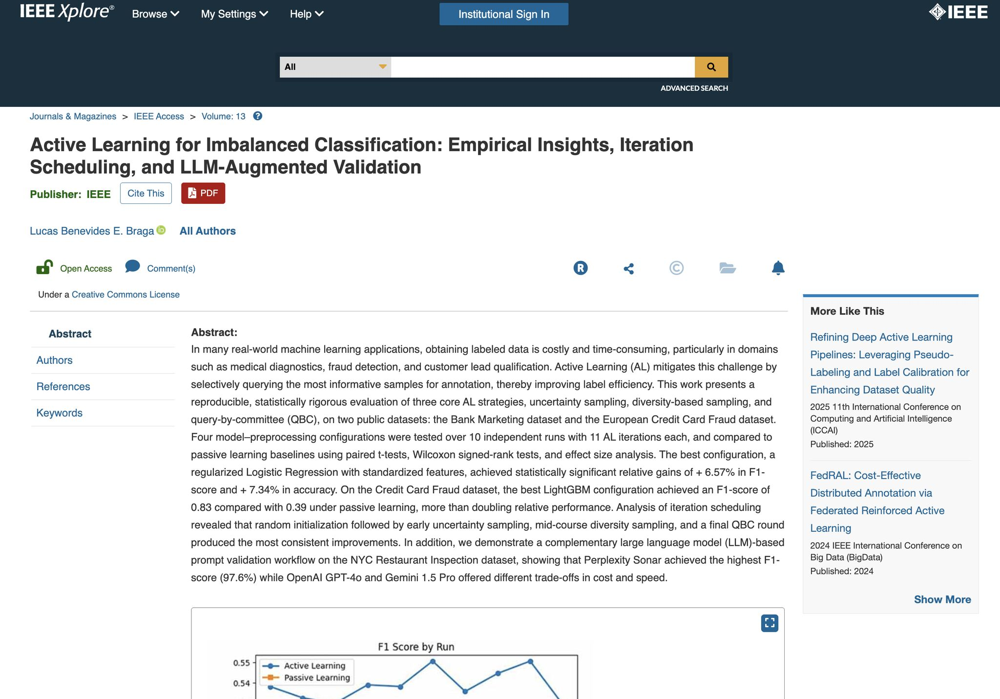
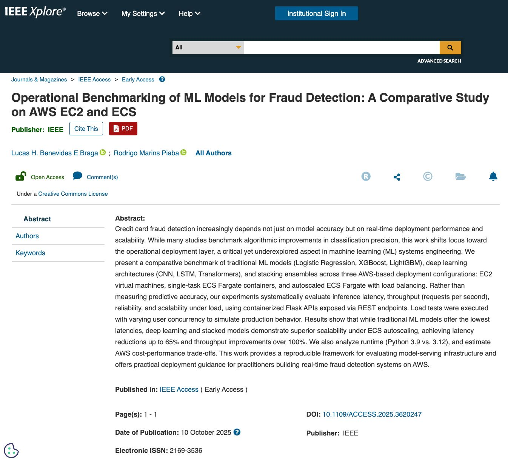
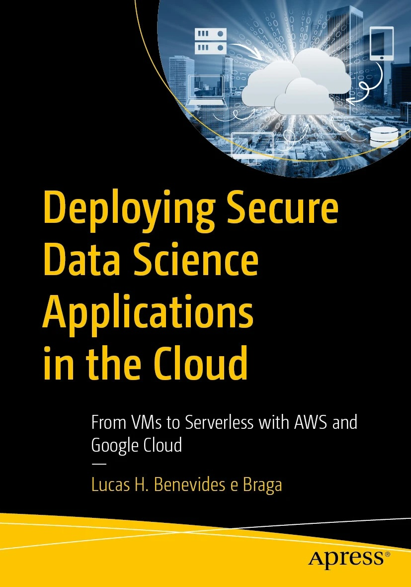
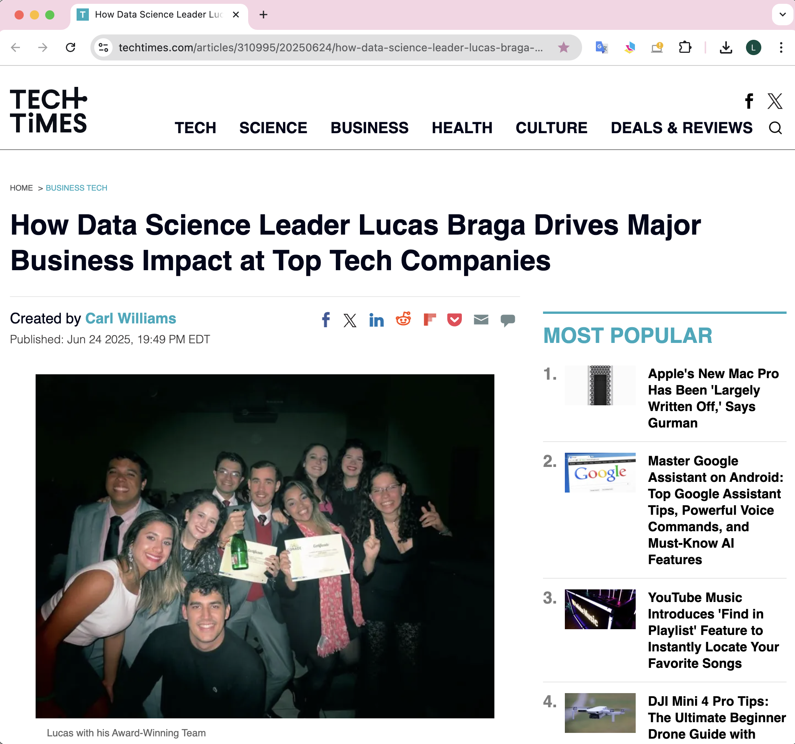

> *"Bridging cutting-edge research with production-ready machine learning solutions"*

---

## Table of Contents

1. [Overview](#overview)
2. [Research Publications](#research-publications)
3. [Book Publication](#book-publication)
4. [Technical Articles & Projects](#technical-articles--projects)
5. [Professional Experience Highlights](#professional-experience-highlights)
6. [Media Coverage & Recognition](#media-coverage--recognition)
7. [Technical Expertise](#technical-expertise)
8. [Research Interests](#research-interests)
9. [Contact Information](#contact-information)

---

## Overview

Lucas Braga serves as **Lead Data Scientist** at Wolt (DoorDash International), bringing over a decade of experience in data science at leading global companies. His work encompasses advanced machine learning, experimentation, LLM-powered business solutions, production-scale fraud detection, and merchant intelligence systems deployed across 35+ international markets.

### Career Highlights
- **Current Role**: Lead Data Scientist at Wolt (DoorDash International) - January 2025
- **Published Book Author**: ["Deploying Secure Data Science Applications in the Cloud"](https://link.springer.com/book/9798868817144) *(Apress/Springer, 2025)*
- **Research Publications**: 2 IEEE Access papers (2025) + **Official IEEE Peer Reviewer** (8+ papers)
- **Media Recognition**: Featured in TechTimes, UOL Brazil, R7 for AI leadership
- **Industry Impact**: €96M+ in GMV gains, €5M+ fraud prevention, 2000+ hours/month automation savings
- **Education**: MS Applied Statistics & Data Science (Kansas University, 2020)
- **Certifications**:  Google Associate Cloud Engineer (2024),  AWS ML Specialty (2020)

---

## Research Publications

<div style="display: flex; align-items: flex-start; gap: 20px; margin-bottom: 20px;">


<div>

<h3>Active Learning for Imbalanced Classification</h3>
<p><em>IEEE Access Publication + Production-Ready Framework</em></p>

<p><strong>Publication</strong>: <a href="https://ieeexplore.ieee.org/document/11215701">IEEE Access</a> <em>(DOI: 10.1109/ACCESS.2025.3624650)</em><br>
<strong>Repository</strong>: <a href="https://github.com/lucasbraga461/active-learning">github.com/lucasbraga461/active-learning</a></p>

</div>
</div>

```
Research Impact:
├── 6.57% F1 improvement over passive learning with champion strategy
├── 300-600% F1 gains in fraud detection applications
├── 75 unique configurations with comprehensive experimental validation
├── Multi-LLM validation framework (97.6% accuracy with Perplexity AI)
└── Champion strategy: 4-1-2-1-2-1 pattern optimization
```

**Technologies**: Python, Scikit-Learn, LightGBM, OpenAI API, Perplexity API, Gemini API  
**Impact**: Breakthrough research on optimal query strategies for imbalanced datasets with production validation using multiple LLM systems.

---

<div style="display: flex; align-items: flex-start; gap: 20px; margin-bottom: 20px;">


<div>

<h3>Real-Time ML Fraud Detection System</h3>
<p><em>IEEE Access Publication + AWS Deployment Study</em></p>

<p><strong>Publication</strong>: <a href="https://ieeexplore.ieee.org/document/11199034">IEEE Access</a> <em>(DOI: 10.1109/ACCESS.2025.3620247)</em><br>
<strong>Repository</strong>: <a href="https://github.com/lucasbraga461/realtime-ml-fraud-detection">github.com/lucasbraga461/realtime-ml-fraud-detection</a></p>

</div>
</div>

```
Performance Achievements:
├── 12 ML/DL models compared (CNN, LSTM, Transformer, Ensemble)
├── 3 AWS deployment architectures benchmarked (EC2, ECS Fargate, ECS+ALB)
├── 1000+ requests/second throughput with auto-scaling
├── Complete CI/CD pipeline with Infrastructure as Code
└── Production-ready system with comprehensive load testing
```

**Technologies**: TensorFlow, LightGBM, XGBoost, AWS ECS, Fargate, ALB, Docker, Terraform  
**Impact**: Comprehensive comparative study providing production deployment guidelines for real-time ML systems at scale.

---

### IEEE Access Peer Reviewer

**Official Recognition**: Recognized by IEEE Access as a peer reviewer for AI/ML papers (ISSN: 2169-3536)

**Review Portfolio**: 8+ papers reviewed across cutting-edge AI/ML research topics
- **Review Links**: [Available on ORCID Profile](https://orcid.org/0009-0007-5397-5652)
- **Expertise Areas**: Machine Learning, Artificial Intelligence, Data Science Applications
- **Impact**: Contributing to the advancement of AI/ML research through rigorous peer review

---

## Book Publication

<div style="display: flex; align-items: flex-start; gap: 20px; margin-bottom: 20px;">


<div>

<h3>Deploying Secure Data Science Applications in the Cloud</h3>
<p><em>Peer-Reviewed Technical Book | Apress/Springer Nature</em></p>

<p><strong>Publication</strong>: <a href="https://link.springer.com/book/9798868817144">Apress/Springer Book</a> <em>(September 2025)</em><br>
<strong>Purchase</strong>: <a href="https://www.amazon.com/Deploying-Secure-Science-Applications-Cloud/dp/B0FCKTNL3W">Amazon</a><br>
<strong>Repository</strong>: <a href="https://github.com/lucasbraga461/deploy-secure-ds-apps-book">Complete Implementation Code</a></p>

</div>
</div>

```
Book Coverage:
├── 13 practical chapters (VMs → Serverless architectures)
├── Multi-cloud strategies (AWS ECS Fargate + Google Cloud Run)
├── Security best practices (SSL/TLS, authentication, data protection)
├── CI/CD pipelines with Jenkins for data science workflows
└── Infrastructure as Code with Terraform automation
```

**Technologies**: AWS, GCP, Docker, Nginx, Jenkins, Streamlit, Flask, Terraform  
**Peer Review**: Technically reviewed by cloud architecture and data science deployment experts  
**Impact**: Comprehensive guide bridging the gap between data science development and secure production deployment across multiple cloud platforms.

---

## Technical Articles & Projects

### Website Quality Scoring Engine
*Towards Data Science Article + Scalable Production Implementation*

**Article**: [Towards Data Science](https://towardsdatascience.com/creative-website-feature-engineering-using-pyspark-python-snowflake/)  
**Repository**: [github.com/lucasbraga461/feat-eng-websites](https://github.com/lucasbraga461/feat-eng-websites)

```
Technical Architecture:
├── Async web scraping (asyncio + aiohttp for concurrent processing)
├── PySpark distributed processing pipeline
├── Snowflake data warehouse integration
├── Quality scoring algorithm (0-10 scale with 50+ features)
├── Production ML feature pipeline for merchant evaluation
└── Multi-market deployment across 6+ countries
```

**Technologies**: Python, PySpark, Snowflake, AsyncIO, BeautifulSoup, Pandas  
**Impact**: Automated quality assessment system for thousands of merchant websites enabling data-driven business decisions.

---

### Statistical Sample Size Calculator
*Towards Data Science Article + Live Production Tool*

**Article**: [Towards Data Science](https://towardsdatascience.com/mastering-sample-size-calculations-75afcddd2ff3)  
**Live Application**: [Sample Size Calculator](http://18.231.252.63:8080/)  
**Repository**: [github.com/lucasbraga461/sample-size-calculator](https://github.com/lucasbraga461/sample-size-calculator)


```
Tool Features:
├── Live web application deployed on Google Cloud Run
├── Statistical formulas for A/B testing (means & proportions)
├── Interactive Streamlit interface with real-time calculations
├── Docker containerization for reproducible deployment
├── Comprehensive mathematical documentation with examples
└── Monte Carlo validation experiments
```

**Technologies**: Streamlit, Docker, Google Cloud Run, Statistical Analysis, Monte Carlo  
**Impact**: Production tool enabling data teams to design statistically sound experiments with proper sample sizing.

---

### ML Model Evaluation Framework
*Towards Data Science Article - Classification Metrics Guide*

**Article**: [Towards Data Science](https://towardsdatascience.com/metrics-to-evaluate-a-classification-machine-learning-model-f05f1facd569)

**Focus**: Comprehensive framework for classification model assessment covering precision, recall, F1-score, AUC-ROC, and business-specific metrics with practical implementation examples.

**Impact**: Widely-read guide helping data science practitioners select appropriate evaluation metrics for production ML systems.

---

## Professional Experience Highlights

###  [Wolt](https://wolt.com) ([DoorDash International](https://doordash.com)) - Lead Data Scientist *(January 2025 - Present)*
**Global technology company operating in 35+ countries**
- **LLM Automation**: Deployed customer support conversation tagging system, saving 2000+ hours/month of manual work
- **Market Intelligence**: Built NLP-powered cuisine classification models for 1M+ restaurants across 25+ countries
- **Merchant Intelligence**: Reduced false positives in merchant classification from 42% to 9% in 2 months using Active Learning
- **Strategic Experimentation**: Conducted offline experimentation on cuisine strategy, developing global positioning frameworks to maintain competitive advantage in market value

###  [Delivery Hero](https://deliveryhero.com) - Staff Data Scientist / Manager *(2019 - 2024)*
**Global leader in food delivery operating in 70+ countries | Berlin-based, €10B+ market cap**
- **Business Impact**: Generated €96M+ annual GMV through payment optimization in Middle East
- **Fraud Prevention**: Prevented €5M+ in fraudulent transactions across international markets
- **Credit Risk**: Reduced BNPL default rates from 12% to 5% in UAE, enabling 30% higher revenue
- **Team Leadership**: Led and mentored 3 data scientists across fraud detection and credit risk

###  [DHL](https://dhl.com) - Data Scientist *(2015 - 2019)*
**World's leading logistics company in 220+ countries | €81B+ revenue**
- **Process Automation**: Streamlined operations through automated reporting pipelines and workflow optimization
- **Operational Efficiency**: Automated invoice digitization and controlling workflows
- **Profitability Analysis**: Identified unprofitable accounts, supporting senior leadership in contract renegotiation

---

## Media Coverage & Recognition

<div style="display: flex; align-items: flex-start; gap: 20px; margin-bottom: 20px;">


<div>

<h3>Featured In Major Media Outlets</h3>

<p><strong>International Recognition for Data Science Leadership & AI Innovation</strong></p>

<ul>
<li><a href="https://www.techtimes.com/articles/310995/20250624/how-data-science-leader-lucas-braga-drives-major-business-impact-top-tech-companies.htm">TechTimes.com</a> - <em>"How Data Science Leader Lucas Braga Drives Major Business Impact at Top Tech Companies"</em></li>
<li><a href="https://natelinha.uol.com.br/super-viral/2025/11/07/brasileiro-lucas-benevides-e-braga-lidera-iniciativas-globais-de-inteligencia-artificial-na-europa-e-se-destaca-com-publicacoes-cientificas-e-livro-internacional-233571.php">UOL.com.br</a> - <em>"Brazilian Lucas Benevides e Braga Leads Global AI Initiatives in Europe"</em></li>
<li><a href="https://cartaodevisita.r7.com/conteudo/58723/da-ciencia-de-dados-a-producao-lucas-braga-ensina-como-levar-inteligencia-artificial-para-a-nuvem">R7.com</a> - <em>"From Data Science to Production: Lucas Braga Teaches How to Take AI to the Cloud"</em></li>
</ul>

</div>
</div>

---


## Technical Expertise

### Machine Learning & AI


### Cloud & DevOps


### Data & Analytics


### Development & Visualization


---


## Research Interests

- **Imbalanced Dataset Classification**: Advanced techniques for fraud detection and other highly imbalanced scenarios
- **LLM for Business Problems**: Leveraging large language models to solve real-world business challenges and automation
- **Cloud Machine Learning**: Scalable ML architectures and deployment patterns for production systems

---

### Contact Information
- **Email**: [lucasbraga461@gmail.com](mailto:lucasbraga461@gmail.com)
- **LinkedIn**: [linkedin.com/in/lucasbraga461](https://linkedin.com/in/lucasbraga461)
- **ORCID**: [0009-0007-5397-5652](https://orcid.org/0009-0007-5397-5652)
- **GitHub**: [github.com/lucasbraga461](https://github.com/lucasbraga461)

---

*Last Updated: November 2025*  
*This portfolio is continuously updated with new projects and research findings.*
